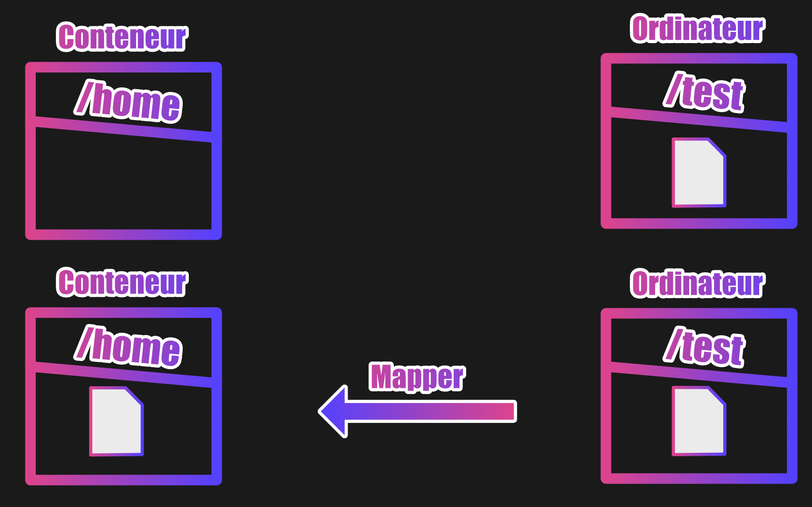

## DOCKER Deux types de volumes.

Nous aborderons deux façons d'utiliser les volumes. Et pour bien comprendre ce que nous faisons nous utiliserons deux expressions.

Dans ce cadre, nous allons mapper des volumes (première expression) ou manager des volumes (deuxième expression).

Pour ces deux types, nous expliquerons les différences et les avantages.

Ensuite dans d'autres leçons, vous aurez la possibilité de pratiquer ce que vous aurez appris pour bien comprendre le fonctionnement de ces deux types de volumes.

## Mapper un volume.

Lorsqu'on utilise le mappage de volume, le dossier dans notre ordinateur local prend le dessus sur le dossier du conteneur.

Par exemple, si nous avons un dossier dans notre machine qui s'appelle /test avec un fichier à l'intérieur dont le nom est index.html et que nous le mappons au dossier /home de notre conteneur Ubuntu (dans notre conteneur le dossier /home ne contient à la base rien du tout), le dossier /home contiendra également le fichier index.html.

