<div align="center">

  <br></br>
  
  <a href="https://github.com/0xCyberLiTech">
    
  </a>
  
  <br></br>

  <p align="center">
    <em>Guides et tutoriels sur la conteneurisation avec Docker.</em><br>
    <b>🐳 Conteneurs – 📦 Isolation – 🚀 Déploiement</b>
  </p>

  [](https://github.com/0xCyberLiTech)
  [](https://github.com/0xCyberLiTech/Docker/releases/latest)
  [](https://github.com/0xCyberLiTech/Docker/blob/main/CHANGELOG.md)
  [](https://github.com/0xCyberLiTech?tab=repositories)
  [](https://github.com/0xCyberLiTech/Docker/graphs/contributors)

</div>

---

### 👨‍💻 **À propos de moi.**

> Bienvenue dans mon **laboratoire numérique personnel** dédié à l’apprentissage et à la vulgarisation de la cybersécurité.  
> Passionné par **Linux**, la **cryptographie** et les **systèmes sécurisés**, je partage ici mes notes, expérimentations et fiches pratiques.  
>  
> Pproposer un contenu clair, structuré et accessible pour étudiants, curieux et professionnels de l’IT.  
> 🔗 [Mon GitHub principal](https://github.com/0xCyberLiTech)

<p align="center">
  <a href="https://github.com/0xCyberLiTech" target="_blank" rel="noopener">
    
  </a>
</p>

---

### 🎯 **Objectif de ce dépôt.**

> Ce dépôt a pour vocation de centraliser un ensemble de notions clés autour de Docker. Il s’adresse aux passionnés, étudiants et professionnels souhaitant mieux comprendre les principes de la conteneurisation,
> apprendre à construire, déployer et gérer des applications avec Docker, et se familiariser avec les concepts et outils essentiels pour optimiser leurs flux de développement et leurs infrastructures.

---

## DOCKER - Mise en place du container GRAFANA :

Intégration de Zabbix à Grafana :

Le plugin Grafana-Zabbix peut être installé sur Grafana pour visualiser les données de Zabbix avec Grafana.

Vous pouvez également l’utiliser pour créer des tableaux de bord Grafana étonnants en utilisant les données de Zabbix.

Je vais également vous montrer comment ajouter un serveur Zabbix comme source de données sur Grafana.

Je vais également vous montrer comment démarrer avec la visualisation de données Grafana avec la source de données Zabbix.

Alors, commençons.

Notre serveur Grafana est issu d'un container en production depuis Docker.

Je joins donc le fichier docker-compose.yml.
```
version: '3.8'
services:
  grafana:
    image: grafana/grafana-enterprise:latest
    container_name: grafana
    restart: unless-stopped
    environment:
      # increases the log level from info to debug
      - GF_LOG_LEVEL=debug
    ports:
      - '3000:3000'
    volumes:
      - 'grafana_storage:/var/lib/grafana'
volumes:
  grafana_storage: {}
```
Exécuter la commande suivante :
```
docker compose up -d
```
L'accès l'interface de Grafana se fait depuis l'url http://192.168.50.250:3000/, remplacer celle-ci par votre adresse ip.

Passons à l'installation du plugin Grafana Zabbix.

Pour ajouter Zabbix en tant que source de données Grafana, vous devez avoir le plugin Grafana-Zabbix installé sur l’ordinateur sur lequel Grafana est installé, ici cela sera donc sur notre container Grafana.

Pour installer le plugin Grafana-Zabbix sur le container sur lequel Grafana est installé, exécutez la commande suivante :

Depuis l'hôte lancer la commande suivante :
```
docker exec -it grafana bash
```
```
grafana-cli plugins install alexanderzobnin-zabbix-app     
```
Le plugin Grafana-Zabbix doit être installé.

Pour que les modifications prennent effet, redémarrez le service systemd grafana-server avec la commande suivante :
```
systemctl restart grafana-server.service
```
Activation du plugin Grafana-Zabbix.

On sort du container Grafana. On se retrouvera sur l'hôte.
```
exit
```
Une fois le plugin Grafana Zabbix installé, vous devez l’activer à partir de l’interface Web du tableau de bord Grafana.

Pour accéder à l’interface Web de Grafana, vous devez connaître l’adresse IP de l’ordinateur sur lequel Grafana est installé. Dans mon cas, l’adresse IP de l’ordinateur sur lequel j’ai installé Grafana est 192.168.50.250.

Ce sera différent pour vous. Alors, assurez-vous de le remplacer par le vôtre à partir de maintenant.
```
hosname -I
```
Pour accéder à l’interface Web de Grafana, visitez http://192.168.50.250:3000 depuis votre navigateur Web préféré.

Identifiants par défaut admin/admin.

Depuis l’interface Web de Grafana, cliquez sur Paramètres > Plugins comme indiqué dans la capture d’écran ci-dessous.

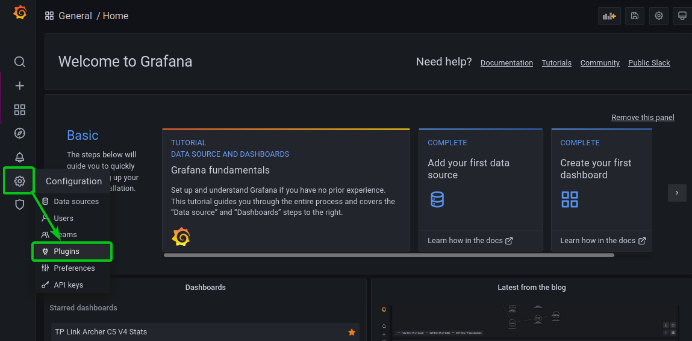

Recherchez le plugin Zabbix et cliquez sur le plugin Zabbix à partir du résultat de la recherche comme indiqué dans la capture d’écran ci-dessous.

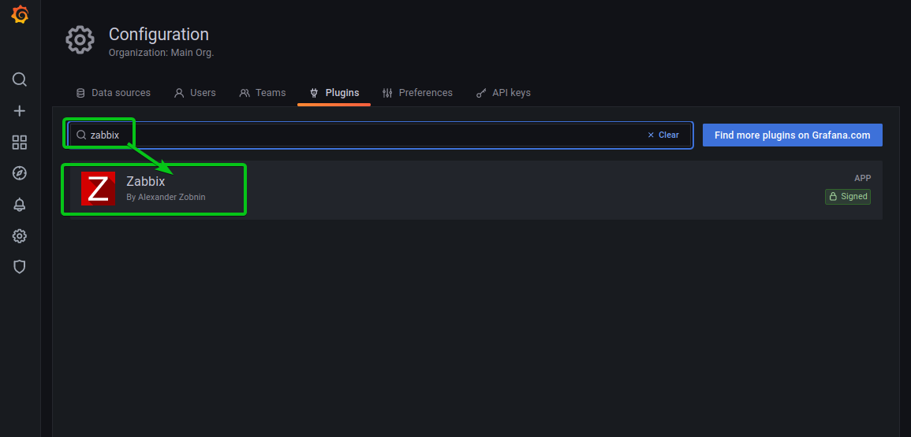

Cliquez sur Activer.

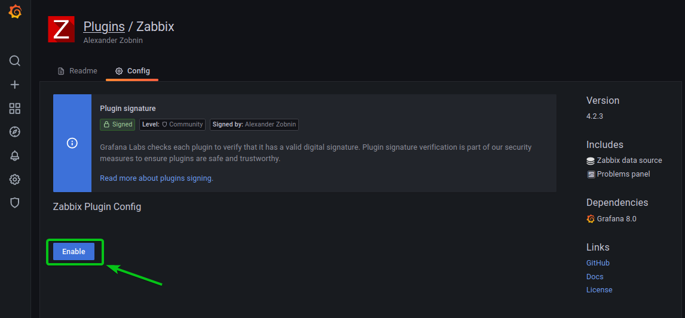

Le plugin Grafana Zabbix doit être activé.

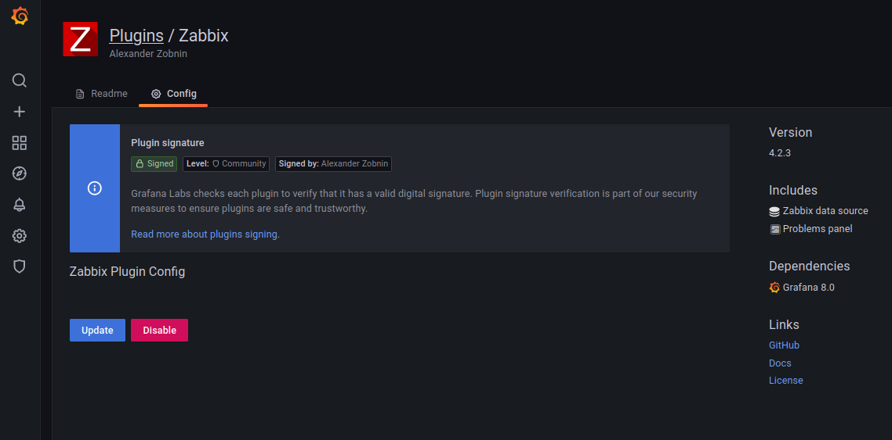

Ajout de la source de données Zabbix sur Grafana.

Une fois le plugin Grafana Zabbix activé, vous pouvez ajouter votre serveur Zabbix en tant que source de données sur Grafana.

Pour ajouter votre serveur Zabbix en tant que source de données sur Grafana, cliquez sur Configuration > Sources de données de l’interface Web de Grafana comme indiqué dans la capture d’écran ci-dessous.

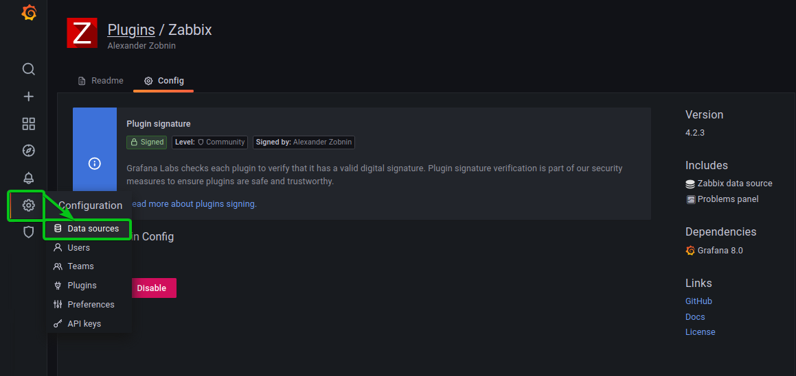

Cliquez sur Ajouter une source de données.

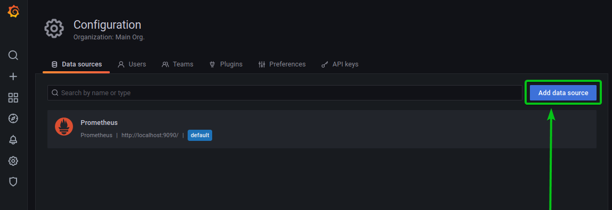

Recherchez la source de données Zabbix et cliquez dessus comme indiqué dans la capture d’écran ci-dessous.

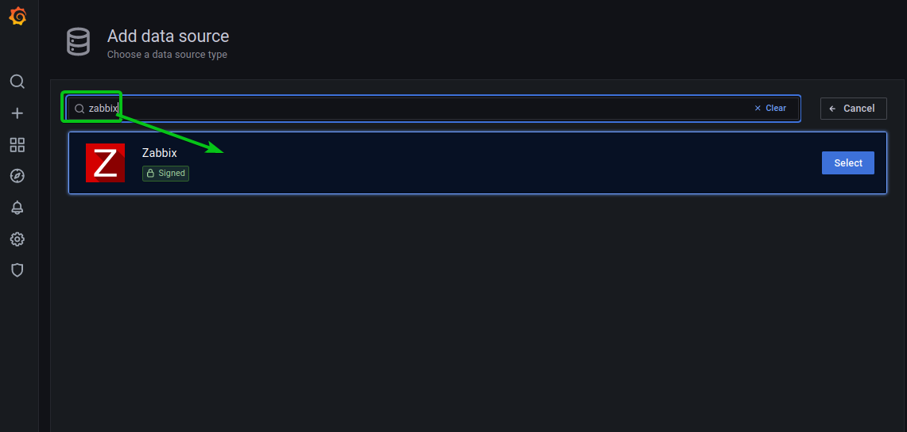

Vous devriez voir la page suivante.

Vous devez ajouter les informations de votre serveur Zabbix (Admin/zabbix), si vous n'avez pas changé le mot de passe par défaut.

Concernant cette installation via ce container, saisir :
```
http://192.168.50.250:8080/api_jsonrpc.php
```
```
https://192.168.50.250/zabbix/api_jsonrpc.php
```
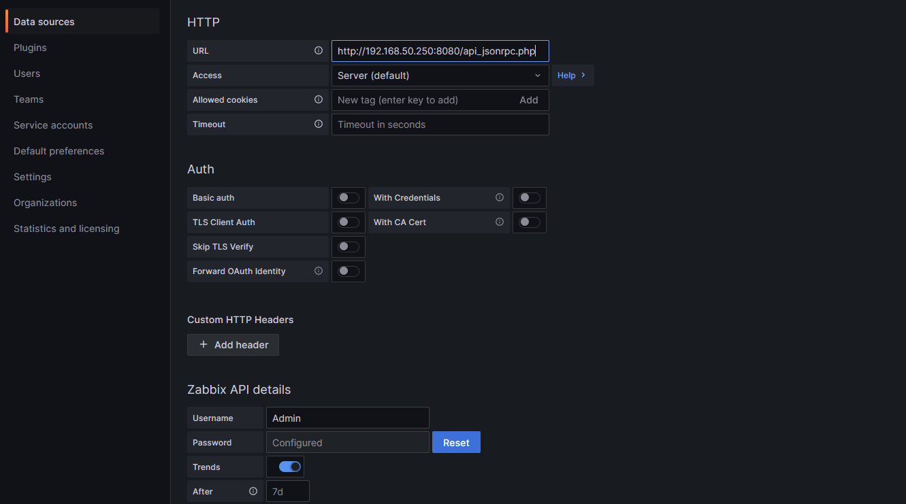

Faites défiler un peu vers le bas et tapez le nom d’utilisateur de connexion et le mot de passe de votre serveur Zabbix dans la section Nom d’utilisateur et Mot de passe respectivement.

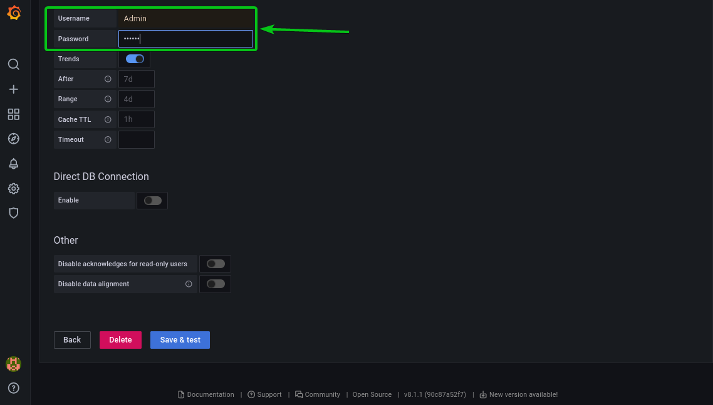

Une fois que vous avez terminé, cliquer sur Enregistrer et tester comme indiqué dans la capture d’écran ci-dessous.

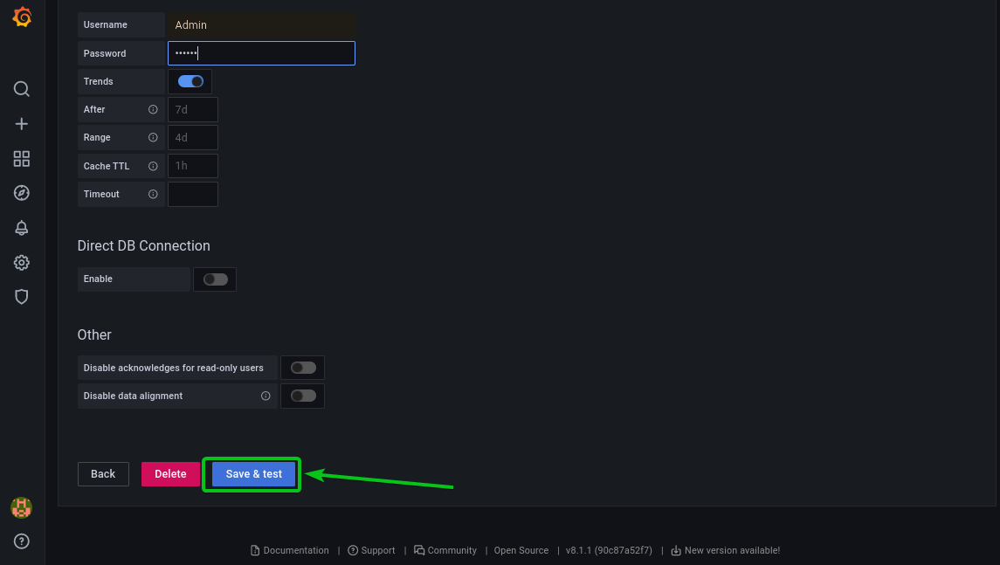

Votre serveur Zabbix doit être ajouté à Grafana en tant que source de données.

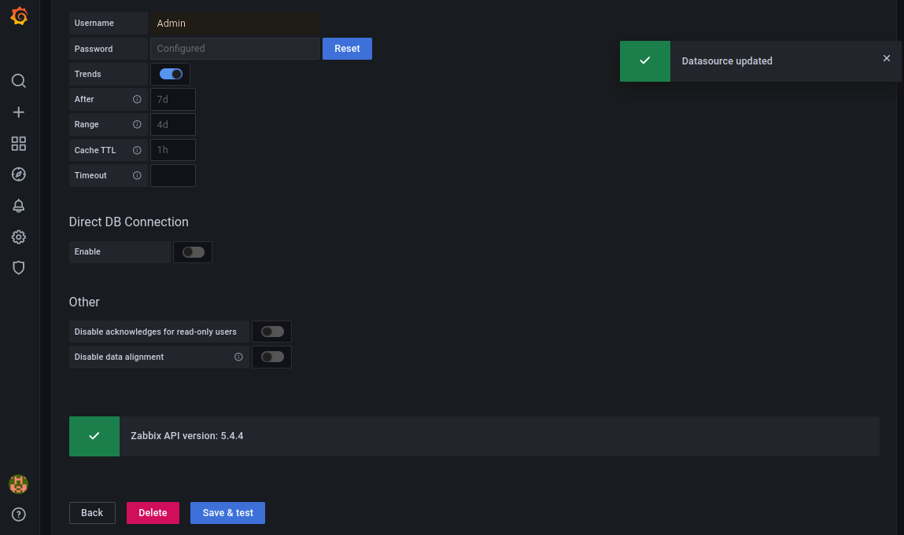

Prochaine étape, surveillance de Zabbix avec Grafana.

Extrait du ripositorie ZABBIX

- 07 - [ZABBIX - Surveillance avec Grafana.md](https://github.com/0xCyberLiTech/Zabbix/blob/main/ZABBIX-Surveillance-avec-Grafana.md)
- 08 - [ZABBIX - Création de base d'un tableau de bord sur Grafana.](https://github.com/0xCyberLiTech/Zabbix/blob/main/ZABBIX-Cr%C3%A9ation-de-base-d-un-tableau-de-bord-Grafana.md)

N'oubliez pas de mettre en place vos règles de firewall ( UFW ).

Exemples de règles :

Ouvrir le port SSH approprié en entrée, afin d'avoir la main sur votre serveur Zabbix à distance.

Dans cet exemple, je n'autorise que la machine distante 192.168.50.118 à pouvoir accéder en SSH sur le serveur Zabbix au travers du port 2277 en TCP en entrée.
```
ufw limit in on enp86s0 from 192.168.50.118 to 192.168.50.250 port 2277 proto tcp comment '2277 SSH'
```
La variable 'limit' correspond à n'autoriser que 6 tentatives de connexion en 30 secondes sur notre règle. 

Cela permet de renfocer un peu plus la sécurité.

Ouvrir le port 80 sur le serveur Zabbix ainsi que le port 443 en entrée.
```
ufw allow in on enp86s0 from 192.168.50.118 to 192.168.50.250 port 80 proto tcp comment '80 Apache2'
```
```
ufw allow in on enp86s0 from 192.168.50.118 to 192.168.50.250 port 443 proto tcp comment '443 Apache2'
```
- Il faut autoriser le LANSUBNET 192.168.0.0/16 à communiquer vers le serveur Zabbix (192.168.50.250) à travers le port 10050 en TCP, pour le mode passif.
- Il faut autoriser le LANSUBNET 192.168.0.0/16 à communiquer vers le serveur Zabbix (192.168.50.250) à travers le port 10051 en TCP, pour le mode actif.

Ces ports doivent être ouverts en entrée sur le serveur Zabbix, afin de recueillir les communications en provenance des agent Zabbix des hôtes distants, que ce soit en mode passif ou en mode actif.
```
ufw allow in on enp86s0 from 192.168.0.0/16 to 192.168.50.250 port 10050 proto tcp comment '1050 agent Zabbix - For Passive checks'
```
```
ufw allow in on enp86s0 from 192.168.0.0/16 to 192.168.50.250 port 10051 proto tcp comment '1051 agent Zabbix - For Active checks'
```
Lister les règles en service :
```
ufw status numbered
```
```
     To                         Action      From
     --                         ------      ----
[ 1] 192.168.50.250 2277/tcp on enp86s0 ALLOW IN    192.168.50.118             # 2277 SSH
[ 2] 192.168.50.250 80/tcp on enp86s0 ALLOW IN    192.168.50.118             # 80 Apache2
[ 3] 192.168.50.250 443/tcp on enp86s0 ALLOW IN    192.168.50.118             # 443 Apache2
[ 4] 192.168.50.250 10050/tcp on enp86s0 ALLOW IN    192.168.0.0/16             # 1050 agent Zabbix - For Passive checks
[ 5] 192.168.50.250 10051/tcp on enp86s0 ALLOW IN    192.168.0.0/16             # 1051 agent Zabbix - For Active checks
```
Autre exemple : d'autres règles de ce type peuvent également être mises en place.

Dans cet exemple, nous avons installé Docker sur notre serveur Zabbix et également déployé Grafana sous la forme d'un container.

De nouvelles règles seront mises en service afin d'assurer la communication entre docker, Grafana et votre réseau local.
```
ufw allow from 172.17.0.0/16 to 192.168.50.0/24 proto tcp comment 'LANSUBNET 172.17.0.0 Docker'
```
```
ufw allow from 172.18.0.0/16 to 192.168.50.0/24 proto tcp comment 'LANSUBNET 172.18.0.0 Docker'
```
Permettre l'accès depuis la machine hôte au portail Portainer.
```
ufw allow in on enp86s0 from 192.168.50.118 to 192.168.50.250 port 9443 proto tcp comment '9443 portail Portainer - Docker'
```
Lister à nouveau les règles mis en service :
```
ufw status numbered
```
```
     To                         Action      From
     --                         ------      ----
[ 1] 192.168.50.250 2277/tcp on enp86s0 LIMIT IN    192.168.50.118             # 2277 SSH
[ 2] 192.168.50.250 80/tcp on enp86s0 ALLOW IN    192.168.50.118             # 80 Apache2
[ 3] 192.168.50.250 443/tcp on enp86s0 ALLOW IN    192.168.50.118             # 443 Apache2
[ 4] 192.168.50.250 10050/tcp on enp86s0 ALLOW IN    192.168.0.0/16             # 1050 agent Zabbix - For Passive checks
[ 5] 192.168.50.250 9443/tcp on enp86s0 ALLOW IN    192.168.50.118             # 9443 portail Portainer - Docker
[ 6] 192.168.50.0/24/tcp        ALLOW IN    172.17.0.0/16/tcp          # LANSUBNET 172.17.0.0 Docker
[ 7] 192.168.50.0/24/tcp        ALLOW IN    172.18.0.0/16/tcp          # LANSUBNET 172.18.0.0 Docker
[ 8] 192.168.50.250 10051/tcp on enp86s0 ALLOW IN    192.168.0.0/16             # 1051 agent Zabbix - For Active checks
```

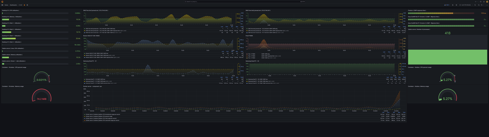

---

<p align="center">
  <b>🔒 Un guide proposé par <a href="https://github.com/0xCyberLiTech">0xCyberLiTech</a> • Pour des tutoriels accessibles à tous. 🔒</b>
</p>
