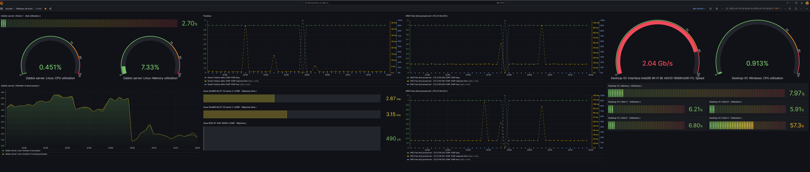

## DOCKER - Mise en place du container GRAFANA :

Intégration de Zabbix à Grafana :

Le plugin Grafana-Zabbix peut être installé sur Grafana pour visualiser les données de Zabbix avec Grafana.

Vous pouvez également l’utiliser pour créer des tableaux de bord Grafana étonnants en utilisant les données de Zabbix.

Je vais également vous montrer comment ajouter un serveur Zabbix comme source de données sur Grafana.

Je vais également vous montrer comment démarrer avec la visualisation de données Grafana avec la source de données Zabbix.

Alors, commençons.

Notre serveur Grafana est issu d'un container en production depuis Docker.

Je joins donc le fichier docker-compose.yml.

```
version: '3.8'
services:
  grafana:
    image: grafana/grafana-enterprise
    container_name: grafana:latest
    restart: unless-stopped
    environment:
      # increases the log level from info to debug
      - GF_LOG_LEVEL=debug
    ports:
      - '3000:3000'
    volumes:
      - 'grafana_storage:/var/lib/grafana'
volumes:
  grafana_storage: {}
```
L'accès l'interface de Grafana se fait depuis l'url http://192.168.50.250:3000/

Passons à l'installation du plugin Grafana Zabbix.

Pour ajouter Zabbix en tant que source de données Grafana, vous devez avoir le plugin Grafana-Zabbix installé sur l’ordinateur sur lequel Grafana est installé.

Pour installer le plugin Grafana-Zabbix sur l’ordinateur sur lequel Grafana est installé, exécutez la commande suivante :

```
sudo grafana-cli plugins install alexanderzobnin-zabbix-app     
```
Le plugin Grafana-Zabbix doit être installé.

Pour que les modifications prennent effet, redémarrez le service systemd grafana-server avec la commande suivante :
```
sudo systemctl redémarrer grafana-server.service
```
Activation du plugin Grafana-Zabbix.

Une fois le plugin Grafana Zabbix installé, vous devez l’activer à partir de l’interface Web du tableau de bord Grafana.

Pour accéder à l’interface Web de Grafana, vous devez connaître l’adresse IP de l’ordinateur sur lequel Grafana est installé. Dans mon cas, l’adresse IP de l’ordinateur sur lequel j’ai installé Grafana est 192.168.50.250.

Ce sera différent pour vous. Alors, assurez-vous de le remplacer par le vôtre à partir de maintenant.
```
hosname -I
```
Pour accéder à l’interface Web de Grafana, visitez http://192.168.50.250:3000 depuis votre navigateur Web préféré.

Depuis l’interface Web de Grafana, cliquez sur Paramètres > Plugins comme indiqué dans la capture d’écran ci-dessous.


Recherchez le plugin Zabbix et cliquez sur le plugin Zabbix à partir du résultat de la recherche comme indiqué dans la capture d’écran ci-dessous.


Cliquez sur Activer.


Le plugin Grafana Zabbix doit être activé.


Ajout de la source de données Zabbix sur Grafana.

Une fois le plugin Grafana Zabbix activé, vous pouvez ajouter votre serveur Zabbix en tant que source de données sur Grafana.

Pour ajouter votre serveur Zabbix en tant que source de données sur Grafana, cliquez sur Configuration > Sources de données de l’interface Web de Grafana comme indiqué dans la capture d’écran ci-dessous.


