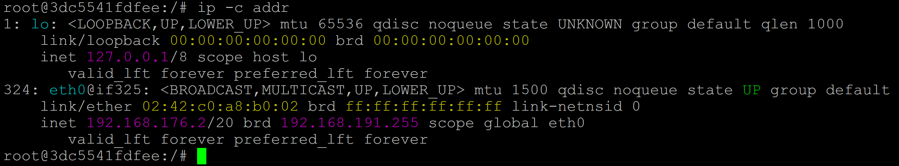
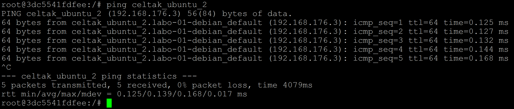
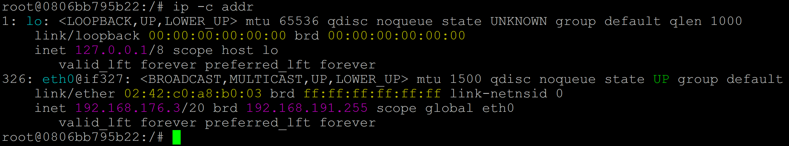
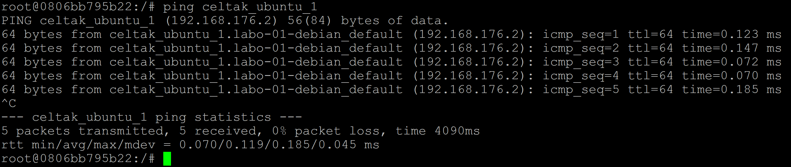
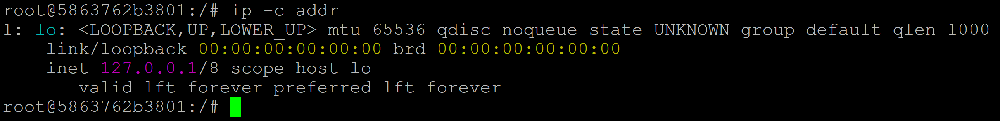

## DOCKER RÉSEAU - Isoler un conteneur Docker du réseau

Pour atteindre cet objectif, nous allons recourir à none.

Faisons un test et tapons cette commande dans deux terminaux différents pour avoir deux conteneurs.

Rappel
```
version: '3.8'

services:
  my_ubuntu_1:
    image: celtak/ubuntu-ping-ip
    container_name: celtak_ubuntu_1
    stdin_open: true
    tty: true

  my_ubuntu_2:
    image: celtak/ubuntu-ping-ip
    container_name: celtak_ubuntu_2
    stdin_open: true
    tty: true
```
```
docker compose up -d
```
```
docker ps
```
Depuis le container celtak_ubuntu_1
```
docker exec -it (celtak_ubuntu_1) bash
```
```
ip -c addr
```

```
ping celtak_ubuntu_2
```


Depuis le container celtak_ubuntu_2
```
docker exec -it (celtak_ubuntu_2) bash
```
```
ip -c addr
```

```
ping celtak_ubuntu_1
```


Nous pouvons contater que ces deux container celtak_ubuntu_ et celtak_ubuntu_2 discutent entre eux.

Arreter et supprimer ces deux containers

A présent repartons de zéro :

Faisons un test et tapons cette commande dans deux terminaux différents pour avoir deux conteneurs.

Maintenant, nous allons vérifier si les conteneurs sont bien isolés, l'un de l'autre (plus de connexion réseau). C'est normalement le cas puisque le pilote none a été utilisé.

Pour ce faire nous allons utiliser une commande que nous connaissons désormais très bien.

Il faut la taper sur les deux terminaux.
```
ip -c a
```
Depuis le terminal 01 :
```
docker run --rm -it --network=none celtak/ubuntu-ping-ip
```
```
root@5863762b3801:/#
```
```
ip -c a
```



Depuis le terminal 02 :
```
docker run --rm -it --network=none celtak/ubuntu-ping-ip
```
```
root@6ef97c0be0cd:/#
```
```
ip -c a
```

Maintenant, nous allons vérifier si les conteneurs sont bien isolés, l'un de l'autre (plus de connexion réseau). 

C'est normalement le cas puisque le pilote none a été utilisé.

Pour ce faire nous allons utiliser une commande que nous connaissons désormais très bien. Il faut la taper sur les deux terminaux.
```
ip -c addr
```
Si vous avez utilisé le conteneur celtak/ubuntu-ping-ip, normalement ip devrait être disponible. 

Sinon il faudra l'installer aux deux conteneurs pour pouvoir s'en servir.

- [DOCKER RÉSEAU Installer les commandes ping et ip](DOCKER-RÉSEAU-Installer-les-commandes-ping-et-ip.md)

Que voyons-nous 🧐?

On s'aperçoit que les deux conteneurs ne sont pas relié par un réseau.

Il n'y a pas d'adresse IP associé.

Pour être certain de cela, nous allons ouvrir une autre fenêtre dans notre terminal.

Un troisième conteneur va etre mis en service

Ensuite nous allons taper la même commande que précédemment, mais en omettant le paramètre --network=none.

Par conséquent, Docker va attribuer un réseau automatiquement à notre conteneur.
```
docker run --rm -it celtak/ubuntu-ping-ip
```

