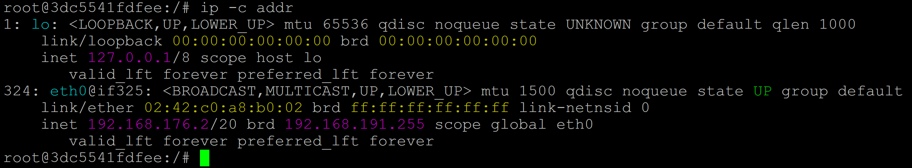
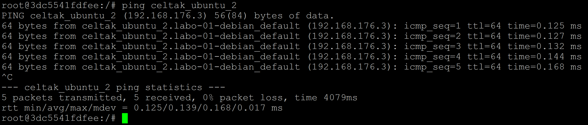
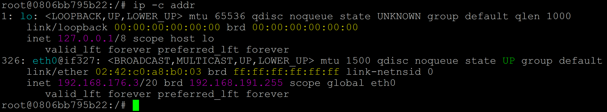
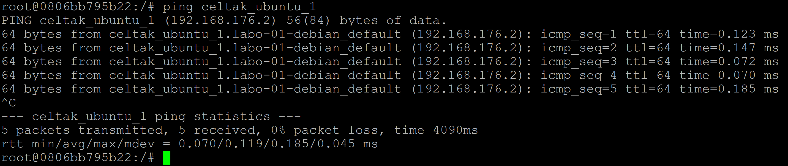
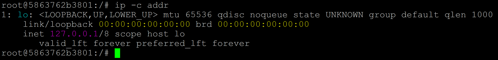
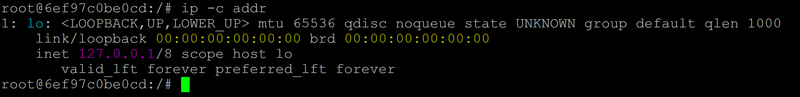
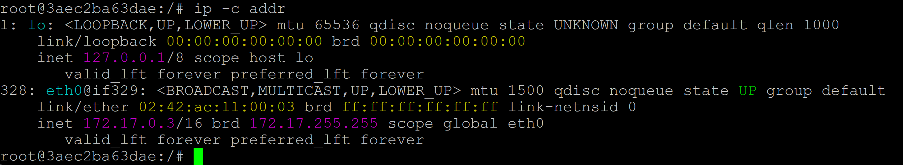

<div align="center">

  <br></br>
  
  <a href="https://github.com/0xCyberLiTech">
    
  </a>
  
  <br></br>

  <h2>Laboratoire numérique pour la cybersécurité, Linux & IT.</h2>

  <p align="center">
    <p align="center">
      <a href="https://0xcyberlitech.github.io/">
        
      </a>
      <a href="https://github.com/0xCyberLiTech">
        
      </a>
      <a href="https://github.com/0xCyberLiTech/Docker/releases/latest">
        
      </a>
      <a href="https://github.com/0xCyberLiTech/Docker/blob/main/CHANGELOG.md">
        
      </a>
      <a href="https://github.com/0xCyberLiTech?tab=repositories">
        
      </a>
      <a href="https://github.com/0xCyberLiTech/Docker/graphs/contributors">
        
      </a>
    </p>
  </p>

</div>

<div align="center">
  
</div>

<div align="center">
  <p>
    <strong>Cybersécurité</strong>  • <strong>Linux Debian</strong>  • <strong>Sécurité informatique</strong> 
  </p>
</div>

---

<div align="center">
  
## À propos & Objectifs.

</div>

Ce projet propose des solutions innovantes et accessibles en cybersécurité, avec une approche centrée sur la simplicité d’utilisation et l’efficacité. Il vise à accompagner les utilisateurs dans la protection de leurs données et systèmes, tout en favorisant l’apprentissage et le partage des connaissances.

Le contenu est structuré, accessible et optimisé SEO pour répondre aux besoins de :
- 🎓 Étudiants : approfondir les connaissances
- 👨‍💻 Professionnels IT : outils et pratiques
- 🖥️ Administrateurs système : sécuriser l’infrastructure
- 🛡️ Experts cybersécurité : ressources techniques
- 🚀 Passionnés du numérique : explorer les bonnes pratiques

---

## DOCKER RÉSEAU - Isoler un conteneur Docker du réseau

Pour atteindre cet objectif, nous allons recourir à none.

Rappel communication entre deux containers :

```
version: '3.8'

services:
  my_ubuntu_1:
    image: celtak/ubuntu-ping-ip
    container_name: celtak_ubuntu_1
    stdin_open: true
    tty: true

  my_ubuntu_2:
    image: celtak/ubuntu-ping-ip
    container_name: celtak_ubuntu_2
    stdin_open: true
    tty: true
```

```
docker compose up -d
```

```
docker ps
```

Depuis le container celtak_ubuntu_1

```
docker exec -it (celtak_ubuntu_1) bash
```

```
ip -c addr
```



```
ping celtak_ubuntu_2
```



Depuis le container celtak_ubuntu_2

```
docker exec -it (celtak_ubuntu_2) bash
```

```
ip -c addr
```



```
ping celtak_ubuntu_1
```



Nous pouvons constater que ces deux containers (celtak_ubuntu_1) et (celtak_ubuntu_2) discutent entre eux.

Arrêter et supprimer ces deux containers

À présent repartons de zéro :

Faisons un test et tapons cette commande dans deux terminaux différents pour avoir deux containers.

Maintenant, nous allons vérifier si les conteneurs sont bien isolés, l'un de l'autre (plus de connexion réseau).

C'est normalement le cas puisque le pilote none a été utilisé.

Pour ce faire nous allons utiliser une commande que nous connaissons désormais très bien.

Il faut la taper sur les deux terminaux.

```
ip -c a
```

Depuis le terminal 01 :

```
docker run --rm -it --network=none celtak/ubuntu-ping-ip
```

```
root@5863762b3801:/#
```

```
ip -c a
```



Depuis le terminal 02 :

```
docker run --rm -it --network=none celtak/ubuntu-ping-ip
```

```
root@6ef97c0be0cd:/#
```

```
ip -c a
```



Que voyons-nous 🧐?

On s'aperçoit que les deux conteneurs ne sont pas relié par un réseau.

Il n'y a pas d'adresse IP associé.

Pour être certain de cela, nous allons ouvrir une autre fenêtre dans notre terminal.

Un troisième conteneur va etre mis en service.

Ensuite nous allons taper la même commande que précédemment, mais en omettant le paramètre --network=none.

Par conséquent, Docker va attribuer un réseau automatiquement à notre conteneur.

```
docker run --rm -it celtak/ubuntu-ping-ip
```



---

<div align="center">

<table>
<tr>
<td align="center"><b>🖥️ Infrastructure & Sécurité</b></td>
<td align="center"><b>💻 Développement & Web</b></td>
<td align="center"><b>🤖 Intelligence Artificielle</b></td>
</tr>
<tr>
<td align="center">
  <a href="https://www.kernel.org/"></a>
  <a href="https://www.debian.org"></a>
  <a href="https://www.gnu.org/software/bash/"></a>
  <br/>
  <a href="https://nginx.org"></a>
  <a href="https://git-scm.com"></a>
</td>
<td align="center">
  <a href="https://www.python.org"></a>
  <a href="https://flask.palletsprojects.com"></a>
  <a href="https://developer.mozilla.org/docs/Web/HTML"></a>
  <br/>
  <a href="https://developer.mozilla.org/docs/Web/CSS"></a>
  <a href="https://developer.mozilla.org/docs/Web/JavaScript"></a>
  <a href="https://code.visualstudio.com"></a>
</td>
<td align="center">
  <a href="https://ollama.com"></a>
  <br/><br/>
  <a href="https://anthropic.com"></a>
</td>
</tr>
</table>

<br/>

<sub>🔒 Projets proposés par <a href="https://github.com/0xCyberLiTech">0xCyberLiTech</a> · Développés en collaboration avec <a href="https://claude.ai">Claude AI</a> (Anthropic) 🔒</sub>

</div>

