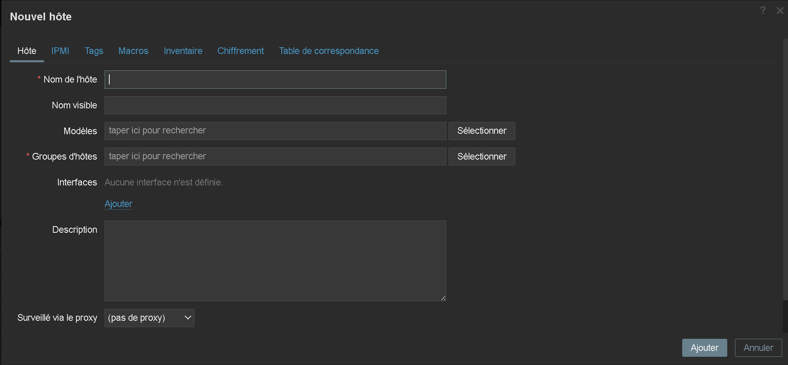
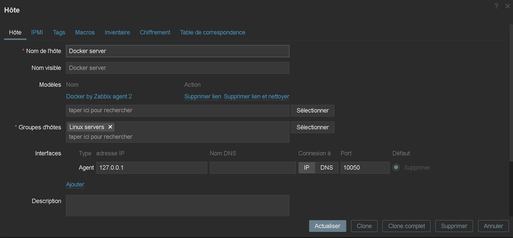
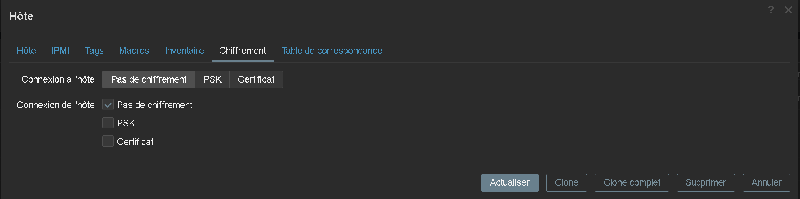

<div align="center">

  <br></br>
  <a href="https://github.com/0xCyberLiTech">
    
  </a>
  <br></br>

  <p align="center">
    <em>Guides et tutoriels sur la conteneurisation avec Docker.</em><br>
    <b>🐳 Conteneurs – 📦 Isolation – 🚀 Déploiement</b>
  </p>

  <p align="center">
    <p align="center">
      <a href="https://0xcyberlitech.github.io/">
        
      </a>
      <a href="https://github.com/0xCyberLiTech">
        
      </a>
      <a href="https://github.com/0xCyberLiTech/Docker/releases/latest">
        
      </a>
      <a href="https://github.com/0xCyberLiTech/Docker/blob/main/CHANGELOG.md">
        
      </a>
      <a href="https://github.com/0xCyberLiTech?tab=repositories">
        
      </a>
      <a href="https://github.com/0xCyberLiTech/Docker/graphs/contributors">
        
      </a>
    </p>
  </p>

</div>

---

### 👨‍💻 **À propos de moi.**

> Bienvenue dans mon **laboratoire numérique personnel** dédié à l’apprentissage et à la vulgarisation de la cybersécurité.  
> Passionné par **Linux**, la **cryptographie** et les **systèmes sécurisés**, je partage ici mes notes, expérimentations et fiches pratiques.  
> Pproposer un contenu clair, structuré et accessible pour étudiants, curieux et professionnels de l’IT.  

<p align="center">
  <a href="https://github.com/0xCyberLiTech" target="_blank" rel="noopener">
    
  </a>
</p>

---

### 🎯 **Objectif de ce dépôt.**

> Ce dépôt a pour vocation de centraliser un ensemble de notions clés autour de Docker. Il s’adresse aux passionnés, étudiants et professionnels souhaitant mieux comprendre les principes de la conteneurisation,
> apprendre à construire, déployer et gérer des applications avec Docker, et se familiariser avec les concepts et outils essentiels pour optimiser leurs flux de développement et leurs infrastructures.

---

## 08 - DOCKER Superviser à l'aide de Zabbix.

Je vais vous expliquer comment superviser un serveur Docker avec Zabbix à l’aide de l’agent 2.

L’agent2 de Zabbix permet de superviser Docker sans avoir besoin d’ajouter de template ou de plugin à l’agent, car il le fait nativement.

Mon environnement :

Un serveur Zabbix installé physiquement (zabbix server).
Un serveur Docker installé physiquement (zabbix server).
Un container Grafana déployé sur Docker (zabbix server).

Configuration de l’hôte dans Zabbix pour superviser Docker.

On est partie, on va commencer par configurer l’hôte dans Zabbix.

Aller dans le menu de gauche sur (Collecte de données), puis cliquer sur hôtes.

Cliquer en haut à droite sur le bouton (Créer un Hôte).



Dans la liste des templates, rechercher Docker 1 et sélectionner Docker by Zabbix agent 2





Il faut intervenir sur le serveur Docker :

Une petite manipulation est à faire pour que l’agent Zabbix puisse collecter les données au niveau du service Docker.

Il faut ajouter l’utilisateur Zabbix qui est utilisé par l’agent, dans le groupe Docker du serveur.

Pour cela entrer la commande suivante :

```
sudo usermod -aG docker zabbix
```

Redémarrer ensuite le service de l’agent Zabbix pour la prise en compte :

```
sudo systemctl  restart zabbix-agent2
```

---

<p align="center">
  <b>🔒 Un guide proposé par <a href="https://github.com/0xCyberLiTech">0xCyberLiTech</a> • Pour des tutoriels accessibles à tous. 🔒</b>
</p>
