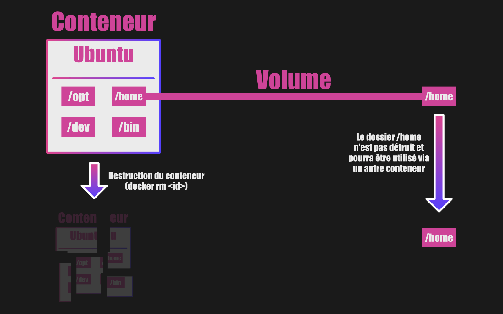

    
  
  
  
    

  <h2>Laboratoire numérique pour la cybersécurité, Linux & IT</h2>

  

    

      
      
      
      
      
      
    

  

<!--
Optimisation SEO : mots-clés Docker, 0xCyberLiTech, tutoriels, guides, administration système, scripts Bash, Debian, docker, docker compose, docker grafana, docker zabbix, volume, port, réseau, container, portainer, isolation, log, ressources techniques, étudiants, professionnels, formation, réseau, IT, bonnes pratiques, passionnés.
-->

  

  

    <strong>Cybersécurité</strong>  • <strong>Linux Debian</strong>  • <strong>Sécurité informatique</strong> 
  

---

## 🚀 À propos & Objectifs

Ce projet propose des solutions innovantes et accessibles en cybersécurité, avec une approche centrée sur la simplicité d’utilisation et l’efficacité. Il vise à accompagner les utilisateurs dans la protection de leurs données et systèmes, tout en favorisant l’apprentissage et le partage des connaissances.

Le contenu est structuré, accessible et optimisé SEO pour répondre aux besoins de :
- 🎓 Étudiants : approfondir les connaissances
- 👨‍💻 Professionnels IT : outils et pratiques
- 🖥️ Administrateurs système : sécuriser l’infrastructure
- 🛡️ Experts cybersécurité : ressources techniques
- 🚀 Passionnés du numérique : explorer les bonnes pratiques

---

## DOCKER VOLUME - Comprendre les volumes dans Docker.

Que sont les volumes dans Docker ?

Les volumes permettent de garder en mémoire des données de manière permanente.

Pour bien comprendre nous allons utiliser un exemple.

Imaginez que vous ayez un conteneur avec une distribution Linux. Par exemple Ubuntu.

Le conteneur servira à lancer un système d'exploitation Linux. Mais qu'en est-il de certaines données ? Par exemple celles présentes dans le répertoire personnel /home.

Elles sont enregistrées également dans le conteneur.

Mais si nous supprimons le conteneur, nous supprimons aussi les données.

Comment palier à ce problème ?

Grâce aux volumes.

Ils vous permettront de garder en mémoire des dossiers de votre choix de votre conteneur.

Grâce à cette technique, vous pouvez garder des informations de manière permanente.

Pourquoi utiliser les volumes ?

Le volume est une fonctionnalité très intéressante dans Docker.

Elle rend l'utilisation des conteneurs encore plus attrayants.

En effet, sans celle-ci, dès lors que nous supprimons un conteneur, toutes les données sont supprimées.

Avec des volumes bien configurés, il est possible de réutiliser certaines données dans un autre conteneur, de les exporter ailleurs ou de les importer.

C'est particulièrement profitable pour les conteneurs de bases de données.

Mais pas seulement.

Pour les fichiers de configurations aussi (Nginx pour ne parler que de lui, mais c'est le cas pour n'importe quel autre serveur web ou programme qui nécessite des fichiers de configuration).

---

  

  <b>🔒 Un guide proposé par <a href="https://github.com/0xCyberLiTech">0xCyberLiTech</a> • Pour des tutoriels accessibles à tous. 🔒</b>

