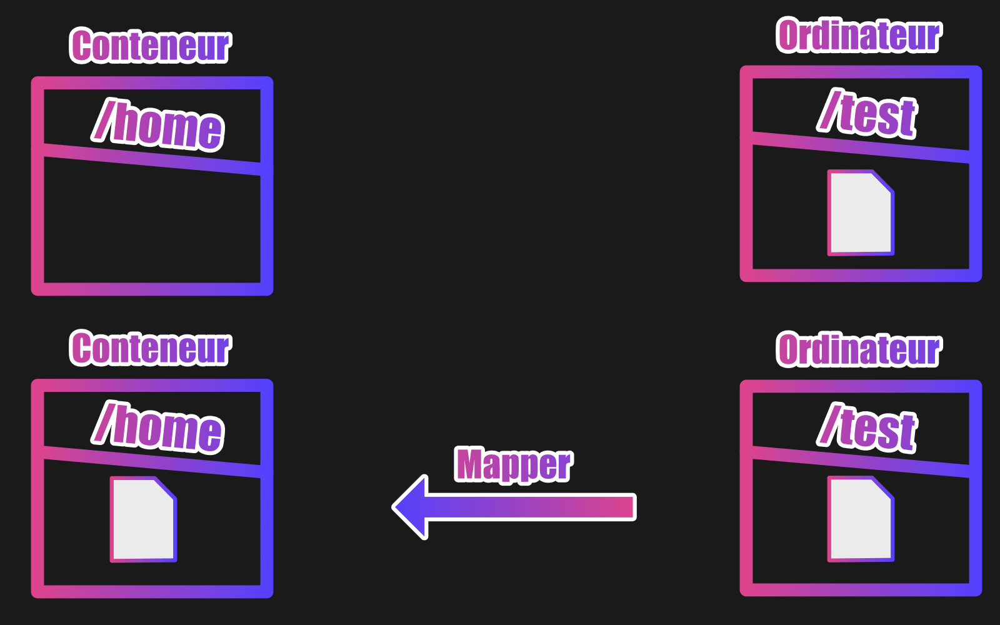
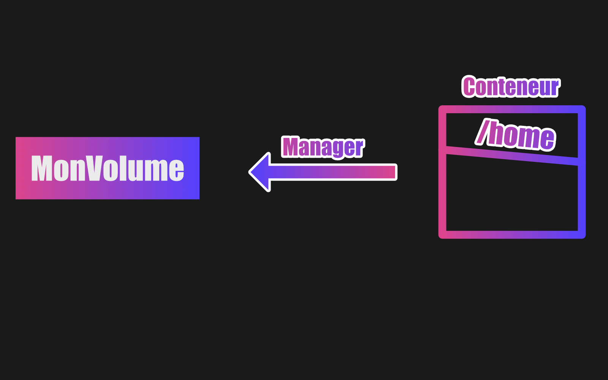

    
  
  
  
    

  <h2>Laboratoire numérique pour la cybersécurité, Linux & IT</h2>

  

    

      
      
      
      
      
      
    

  

  

  

    <strong>Cybersécurité</strong>  • <strong>Linux Debian</strong>  • <strong>Sécurité informatique</strong> 
  

---

## 🚀 À propos & Objectifs

Ce projet propose des solutions innovantes et accessibles en cybersécurité, avec une approche centrée sur la simplicité d’utilisation et l’efficacité. Il vise à accompagner les utilisateurs dans la protection de leurs données et systèmes, tout en favorisant l’apprentissage et le partage des connaissances.

Le contenu est structuré, accessible et optimisé SEO pour répondre aux besoins de :
- 🎓 Étudiants : approfondir les connaissances
- 👨‍💻 Professionnels IT : outils et pratiques
- 🖥️ Administrateurs système : sécuriser l’infrastructure
- 🛡️ Experts cybersécurité : ressources techniques
- 🚀 Passionnés du numérique : explorer les bonnes pratiques

---

## DOCKER VOLUME - Deux types de volumes.

Nous aborderons deux façons d'utiliser les volumes.

Et pour bien comprendre ce que nous faisons nous utiliserons deux expressions.

Dans ce cadre, nous allons mapper des volumes (première expression) ou manager des volumes (deuxième expression).

Pour ces deux types, nous expliquerons les différences et les avantages.

## Mapper un volume.

Lorsqu'on utilise le mappage de volume, le dossier dans notre ordinateur local prend le dessus sur le dossier du conteneur.

Par exemple, si nous avons un dossier dans notre machine qui s'appelle /test avec un fichier à l'intérieur dont le nom est index.html et que nous le mappons au dossier /home de notre conteneur Ubuntu (dans notre conteneur le dossier /home ne contient à la base rien du tout), le dossier /home contiendra également le fichier index.html.

Et s'il y avait eu d'autres fichiers dans le dossier /home, ils disparaîtront, car ils n'existeraient pas dans le dossier /test.

Autre chose, si je modifie le fichier index.html dans le conteneur et qu'après je le détruise, le contenu de ce fichier apparaîtra modifié dans ma machine locale.

Le contrairement est également vrai ! Si je modifie ce fichier en local, il le sera également automatiquement dans le conteneur.

## Manager un volume.

Par contre, lorsque l'on crée un volume managé, c'est le dossier du conteneur qui prend le dessus.

Cependant, la façon de faire dans ce genre de cas est différente par rapport aux volumes mappés.

En effet, il faut obligatoirement créer un volume avec un nom (grâce à une commande Docker) pour ensuite le relier à un dossier du conteneur.

Cela peut paraître compliqué, mais en pratiquant plus tard, les choses seront plus claires.

---

  

  <b>🔒 Un guide proposé par <a href="https://github.com/0xCyberLiTech">0xCyberLiTech</a> • Pour des tutoriels accessibles à tous. 🔒</b>

