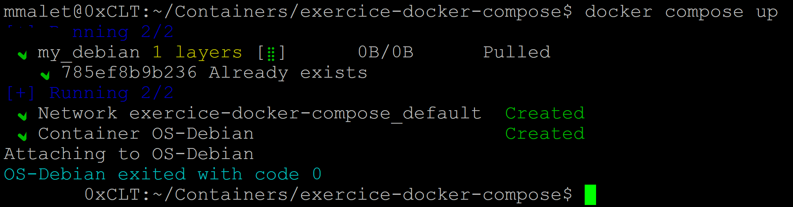
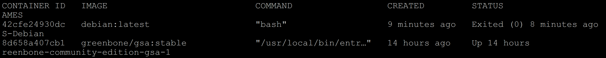
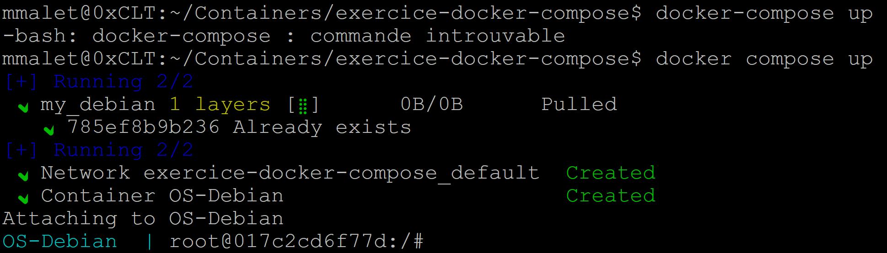

## DOCKER leçon 01 - Débuter avec Docker.

Créer un fichier docker-compose.yml.

Pour bien débuter, je vous propose de créer un nouveau dossier quelque-part sur votre ordinateur. Et dans celui-ci, nous mettrons le fichier docker-compose.yml.

Ce fichier doit absolument porter le nom docker-compose.yml.

Créer le sous dossier exercice-docker-compose

```
mkdir -p ~/Containers/exercice-docker-compose/
```
```
cd /Containers/exercice-docker-compose/
```

```
touch docker-compose.yml
```

Ouvrez le fichier docker-compose.yml via votre éditeur de texte préféré. Ensuite commencez par inscrire le numéro de la version.

## Services.

Après nous allons nous occuper des services.

```
version: '3'


services:
```

Un service représente une image.

Plusieurs subdivisions existent pour bien décrire ce que nous souhaitons faire. 

Commençons par y inscrire celles que nous utiliseront et puis on expliquera leur signification.
```
version: '3.8'

services:
  my_debian:
    image: debian:latest
    container_name: OS-Debian
```
Ces instructions nous indiquent, qu'un seul conteneur sera lancé. 

(my_debian) est le nom du bloc. 

La ligne commençant par (image) indique l'image que nous utiliserons. 

Et enfin container_name est le nom donné à notre conteneur (OS-Debian).

Exécuter docker-compose.yml :

Pour exécuter notre docker-compose.yml, il faut se trouver dans le répertoire qui contient le fichier en question (s'il n'y a pas de fichier portant le nom docker-compose.yml ou docker-compose.yaml, cela ne fonctionnera pas).

Et on tape la commande qui suit.
```
docker compose up
```


L'image va être téléchargée (si celle-ci n'est déjà pas présente dans notre machine). 

Le conteneur va être créé et ensuite automatiquement arrêté.

Mais il sera bien présent (mais pas démarré).
```
docker ps -a
```


Mais voilà, le conteneur s'est arrêté et nous n'avons pas pu interagir avec lui.

Pour y remédier nous allons ajouter deux lignes à notre fichier.

```
version: '3.8'

services:
  my_debian:
    image: debian:latest
    container_name: OS-Debian
    stdin_open: true
    tty: true
```
Sauvegardez le fichier et tapez de nouveau la commande qui suit.
```
docker compose up
```


Le conteneur est lancé. Maintenant ouvrez un autre terminal et tapez la commande suivante.
```
docker ps
```


Nous voyons bien notre conteneur qui a été lancé et ne s'est pas arrêté

Pour interagir directement avec celui-ci copier et coller la commande ci-dessous.
```
docker exec -it 23a278e4bf2b bash
```
```
mmalet@0xCLT:~/Containers/exercice-docker-compose$ docker exec -it 23a278e4bf2b bash
root@23a278e4bf2b:/#
```
Nous sommes bien entrés dans le conteneur.

Tapez exit pour sortir et cliquez sur la combinaison ctrl + C sur l'autre terminal pour arrêter le conteneur.

## Détacher le conteneur du terminal.

Il est possible de faire la même chose, mais en détachant le conteneur du terminal. Celui-ci tournera alors en arrière-plan. Il suffit pour cela d'ajouter l'option -d.

docker-compose up -d
En affichant la liste des conteneurs en cours, vous constaterez que celui-ci décrit dans le docker-compose.yml existe.
```
docker ps
```
## Arrêter.

Pour arrêter le conteneur, on peut utiliser la méthode que l'on connaît déjà.

Mais nous pouvons procéder d'une autre façon.
```
docker compose stop
```
Pareillement pour supprimer notre conteneur, nous pouvons nous appuyer sur ce que nous avons déjà appris ou utiliser la commande qui suit.
```
docker compose rm
```
