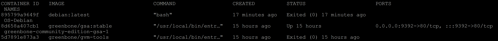
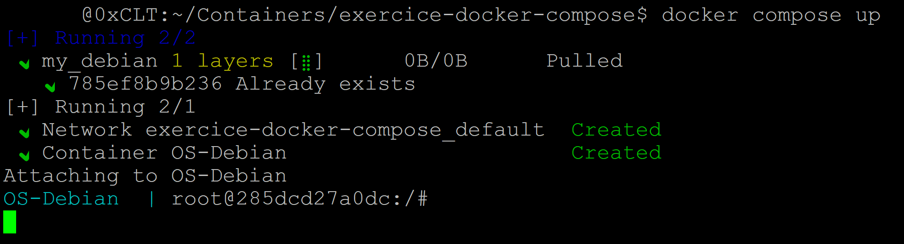
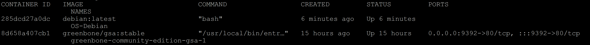

<div align="center">

  <br></br>
  
  <a href="https://github.com/0xCyberLiTech">
    
  </a>
  
  <br></br>

  <p align="center">
    <em>Leçon 01 : Débuter avec Docker.</em><br>
    <b>🐳 Conteneurs – 📦 Isolation – 🚀 Déploiement</b>
  </p>

  <p align="center">
    <p align="center">
      <a href="https://0xcyberlitech.github.io/">
        
      </a>
      <a href="https://github.com/0xCyberLiTech">
        
      </a>
      <a href="https://github.com/0xCyberLiTech/Docker/releases/latest">
        
      </a>
      <a href="https://github.com/0xCyberLiTech/Docker/blob/main/CHANGELOG.md">
        
      </a>
      <a href="https://github.com/0xCyberLiTech?tab=repositories">
        
      </a>
      <a href="https://github.com/0xCyberLiTech/Docker/graphs/contributors">
        
      </a>
    </p>
  </p>

</div>

---

### 👨‍💻 **À propos de moi**

> Bienvenue sur le dépôt <strong>0xCyberLiTech</strong>, votre laboratoire numérique pour l'<strong>apprentissage</strong> et la <strong>vulgarisation</strong> de la <strong>cybersécurité</strong>, de l'<strong>administration Linux Debian</strong> et de la <strong>sécurité informatique</strong>.
> Passionné par <strong>Linux</strong>, la <strong>cryptographie</strong>, la <strong>supervision réseau</strong> et les <strong>systèmes sécurisés</strong>, je partage ici des <strong>tutoriels</strong>, <strong>guides pratiques</strong>, <strong>fiches techniques</strong> et <strong>retours d'expérience</strong> pour renforcer vos compétences IT.
>
> 🎯 <strong>Objectif :</strong> Offrir un contenu structuré, accessible et optimisé pour le référencement naturel, destiné aux étudiants, professionnels, administrateurs système, experts en sécurité et curieux du monde numérique.

---

### 🎯 **Objectif de ce dépôt.**

> Ce dépôt a pour vocation de centraliser un ensemble de notions clés autour de Docker. Il s’adresse aux passionnés, étudiants et professionnels souhaitant mieux comprendre les principes de la conteneurisation,
> apprendre à construire, déployer et gérer des applications avec Docker, et se familiariser avec les concepts et outils essentiels pour optimiser leurs flux de développement et leurs infrastructures.

---

## DOCKER leçon 01 - Débuter avec Docker.

Créer un fichier docker-compose.yml.

Pour bien débuter, je vous propose de créer un nouveau dossier quelque-part sur votre ordinateur. Et dans celui-ci, nous mettrons le fichier docker-compose.yml.

Ce fichier doit absolument porter le nom docker-compose.yml.

Créer le sous dossier exercice-docker-compose

```
mkdir -p ~/Containers/exercice-docker-compose/
```

```
cd /Containers/exercice-docker-compose/
```

```
touch docker-compose.yml
```

Ouvrez le fichier docker-compose.yml via votre éditeur de texte préféré. Ensuite commencez par inscrire le numéro de la version.

## Services.

Après nous allons nous occuper des services.

```
version: '3'


services:
```

Un service représente une image.

Plusieurs subdivisions existent pour bien décrire ce que nous souhaitons faire. 

Commençons par y inscrire celles que nous utiliseront et puis on expliquera leur signification.

```
version: '3.8'

services:
  my_debian:
    image: debian:latest
    container_name: OS-Debian
```

Ces instructions nous indiquent, qu'un seul conteneur sera lancé. 

(my_debian) est le nom du bloc. 

La ligne commençant par (image) indique l'image que nous utiliserons. 

Et enfin container_name est le nom donné à notre conteneur (OS-Debian).

Exécuter docker-compose.yml :

Pour exécuter notre docker-compose.yml, il faut se trouver dans le répertoire qui contient le fichier en question (s'il n'y a pas de fichier portant le nom docker-compose.yml ou docker-compose.yaml, cela ne fonctionnera pas).

Et on tape la commande qui suit.

```
docker compose up
```


L'image va être téléchargée (si celle-ci n'est déjà pas présente dans notre machine). 

Le conteneur va être créé et ensuite automatiquement arrêté.

Mais il sera bien présent (mais pas démarré).

```
docker ps -a
```



Mais voilà, le conteneur s'est arrêté et nous n'avons pas pu interagir avec lui.

Pour y remédier nous allons ajouter deux lignes à notre fichier.

```
version: '3.8'

services:
  my_debian:
    image: debian:latest
    container_name: OS-Debian
    stdin_open: true
    tty: true
```

Sauvegardez le fichier et tapez de nouveau la commande qui suit.

```
docker compose up
```



Le conteneur est lancé. Maintenant ouvrez un autre terminal et tapez la commande suivante.

```
docker ps
```



Nous voyons bien notre conteneur qui a été lancé et ne s'est pas arrêté

Pour interagir directement avec celui-ci copier et coller la commande ci-dessous.

```
docker exec -it 23a278e4bf2b bash
```

```
    @0xCLT:~/Containers/exercice-docker-compose$ docker exec -it 23a278e4bf2b bash
root@23a278e4bf2b:/#
```

Nous sommes bien entrés dans le conteneur.

Tapez exit pour sortir et cliquez sur la combinaison ctrl + C sur l'autre terminal pour arrêter le conteneur.

## Détacher le conteneur du terminal.

Il est possible de faire la même chose, mais en détachant le conteneur du terminal.

Celui-ci tournera alors en arrière-plan. 

Il suffit pour cela d'ajouter l'option -d.

```
docker compose up -d
```

## Arrêter.

Pour arrêter le conteneur, exécuter la commande suivante.

```
docker compose stop
```

Pour supprimer notre conteneur, exécuter la commande suivante.

```
docker compose rm
```

---

<p align="center">
  <a href="https://github.com/0xCyberLiTech" target="_blank" rel="noopener">
    
  </a>
</p>

<p align="center">
  <b>🔒 Un guide proposé par <a href="https://github.com/0xCyberLiTech">0xCyberLiTech</a> • Pour des tutoriels accessibles à tous. 🔒</b>
</p>
