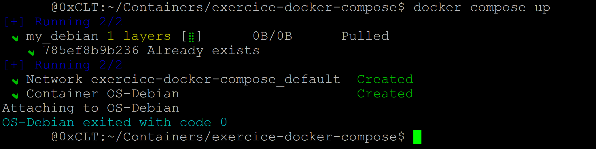
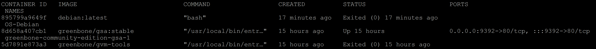
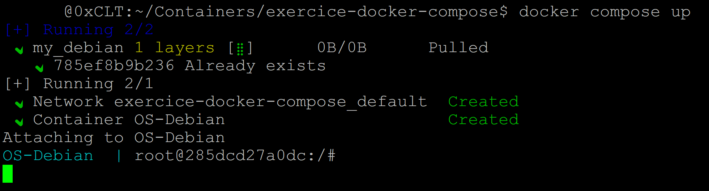
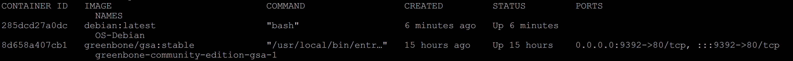

<div align="center">

  <br></br>
  
  <a href="https://github.com/0xCyberLiTech">
    
  </a>
  
  <br></br>

  <h2>Laboratoire numérique pour la cybersécurité, Linux & IT.</h2>

  <p align="center">
    <p align="center">
      <a href="https://0xcyberlitech.github.io/">
        
      </a>
      <a href="https://github.com/0xCyberLiTech">
        
      </a>
      <a href="https://github.com/0xCyberLiTech/Docker/releases/latest">
        
      </a>
      <a href="https://github.com/0xCyberLiTech/Docker/blob/main/CHANGELOG.md">
        
      </a>
      <a href="https://github.com/0xCyberLiTech?tab=repositories">
        
      </a>
      <a href="https://github.com/0xCyberLiTech/Docker/graphs/contributors">
        
      </a>
    </p>
  </p>

</div>

<div align="center">
  
</div>

<div align="center">
  <p>
    <strong>Cybersécurité</strong>  • <strong>Linux Debian</strong>  • <strong>Sécurité informatique</strong> 
  </p>
</div>

---

<div align="center">
  
## À propos & Objectifs.

</div>

Ce projet propose des solutions innovantes et accessibles en cybersécurité, avec une approche centrée sur la simplicité d’utilisation et l’efficacité. Il vise à accompagner les utilisateurs dans la protection de leurs données et systèmes, tout en favorisant l’apprentissage et le partage des connaissances.

Le contenu est structuré, accessible et optimisé SEO pour répondre aux besoins de :
- 🎓 Étudiants : approfondir les connaissances
- 👨‍💻 Professionnels IT : outils et pratiques
- 🖥️ Administrateurs système : sécuriser l’infrastructure
- 🛡️ Experts cybersécurité : ressources techniques
- 🚀 Passionnés du numérique : explorer les bonnes pratiques

---

## DOCKER leçon 01 - Débuter avec Docker.

Créer un fichier docker-compose.yml.

Pour bien débuter, je vous propose de créer un nouveau dossier quelque-part sur votre ordinateur. Et dans celui-ci, nous mettrons le fichier docker-compose.yml.

Ce fichier doit absolument porter le nom docker-compose.yml.

Créer le sous dossier exercice-docker-compose

```
mkdir -p ~/Containers/exercice-docker-compose/
```

```
cd /Containers/exercice-docker-compose/
```

```
touch docker-compose.yml
```

Ouvrez le fichier docker-compose.yml via votre éditeur de texte préféré. Ensuite commencez par inscrire le numéro de la version.

## Services.

Après nous allons nous occuper des services.

```
version: '3'


services:
```

Un service représente une image.

Plusieurs subdivisions existent pour bien décrire ce que nous souhaitons faire. 

Commençons par y inscrire celles que nous utiliseront et puis on expliquera leur signification.

```
version: '3.8'

services:
  my_debian:
    image: debian:latest
    container_name: OS-Debian
```

Ces instructions nous indiquent, qu'un seul conteneur sera lancé. 

(my_debian) est le nom du bloc. 

La ligne commençant par (image) indique l'image que nous utiliserons. 

Et enfin container_name est le nom donné à notre conteneur (OS-Debian).

Exécuter docker-compose.yml :

Pour exécuter notre docker-compose.yml, il faut se trouver dans le répertoire qui contient le fichier en question (s'il n'y a pas de fichier portant le nom docker-compose.yml ou docker-compose.yaml, cela ne fonctionnera pas).

Et on tape la commande qui suit.

```
docker compose up
```



L'image va être téléchargée (si celle-ci n'est déjà pas présente dans notre machine). 

Le conteneur va être créé et ensuite automatiquement arrêté.

Mais il sera bien présent (mais pas démarré).

```
docker ps -a
```



Mais voilà, le conteneur s'est arrêté et nous n'avons pas pu interagir avec lui.

Pour y remédier nous allons ajouter deux lignes à notre fichier.

```
version: '3.8'

services:
  my_debian:
    image: debian:latest
    container_name: OS-Debian
    stdin_open: true
    tty: true
```

Sauvegardez le fichier et tapez de nouveau la commande qui suit.

```
docker compose up
```



Le conteneur est lancé. Maintenant ouvrez un autre terminal et tapez la commande suivante.

```
docker ps
```



Nous voyons bien notre conteneur qui a été lancé et ne s'est pas arrêté

Pour interagir directement avec celui-ci copier et coller la commande ci-dessous.

```
docker exec -it 23a278e4bf2b bash
```

```
    @0xCLT:~/Containers/exercice-docker-compose$ docker exec -it 23a278e4bf2b bash
root@23a278e4bf2b:/#
```

Nous sommes bien entrés dans le conteneur.

Tapez exit pour sortir et cliquez sur la combinaison ctrl + C sur l'autre terminal pour arrêter le conteneur.

## Détacher le conteneur du terminal.

Il est possible de faire la même chose, mais en détachant le conteneur du terminal.

Celui-ci tournera alors en arrière-plan. 

Il suffit pour cela d'ajouter l'option -d.

```
docker compose up -d
```

## Arrêter.

Pour arrêter le conteneur, exécuter la commande suivante.

```
docker compose stop
```

Pour supprimer notre conteneur, exécuter la commande suivante.

```
docker compose rm
```

---

<div align="center">

<table>
<tr>
<td align="center"><b>🖥️ Infrastructure & Sécurité</b></td>
<td align="center"><b>💻 Développement & Web</b></td>
<td align="center"><b>🤖 Intelligence Artificielle</b></td>
</tr>
<tr>
<td align="center">
  <a href="https://www.kernel.org/"></a>
  <a href="https://www.debian.org"></a>
  <a href="https://www.gnu.org/software/bash/"></a>
  <br/>
  <a href="https://nginx.org"></a>
  <a href="https://git-scm.com"></a>
</td>
<td align="center">
  <a href="https://www.python.org"></a>
  <a href="https://flask.palletsprojects.com"></a>
  <a href="https://developer.mozilla.org/docs/Web/HTML"></a>
  <br/>
  <a href="https://developer.mozilla.org/docs/Web/CSS"></a>
  <a href="https://developer.mozilla.org/docs/Web/JavaScript"></a>
  <a href="https://code.visualstudio.com"></a>
</td>
<td align="center">
  <a href="https://ollama.com"></a>
  <br/><br/>
  <a href="https://anthropic.com"></a>
</td>
</tr>
</table>

<br/>

<sub>🔒 Projets proposés par <a href="https://github.com/0xCyberLiTech">0xCyberLiTech</a> · Développés en collaboration avec <a href="https://claude.ai">Claude AI</a> (Anthropic) 🔒</sub>

</div>

