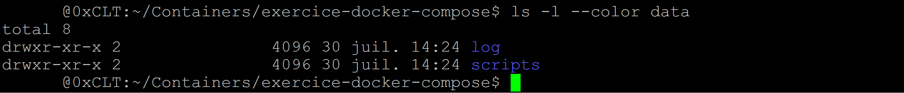
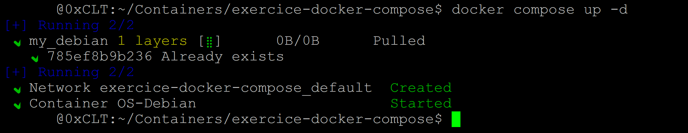
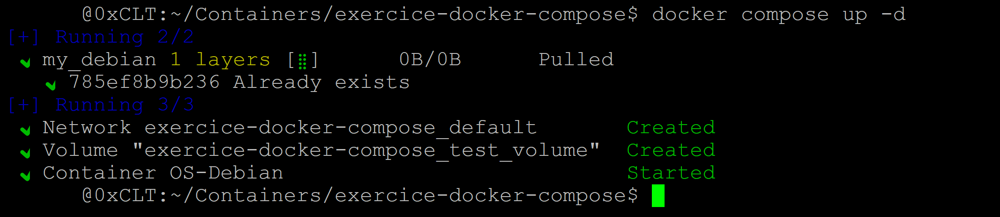

<div align="center">

  <br></br>
  
  <a href="https://github.com/0xCyberLiTech">
    
  </a>
  
  <br></br>

  <h2>Laboratoire numérique pour la cybersécurité, Linux & IT</h2>

  <p align="center">
    <p align="center">
      <a href="https://0xcyberlitech.github.io/">
        
      </a>
      <a href="https://github.com/0xCyberLiTech">
        
      </a>
      <a href="https://github.com/0xCyberLiTech/Docker/releases/latest">
        
      </a>
      <a href="https://github.com/0xCyberLiTech/Docker/blob/main/CHANGELOG.md">
        
      </a>
      <a href="https://github.com/0xCyberLiTech?tab=repositories">
        
      </a>
      <a href="https://github.com/0xCyberLiTech/Docker/graphs/contributors">
        
      </a>
    </p>
  </p>

</div>

<!--
Optimisation SEO : mots-clés cybersécurité, Linux, administration système, sécurité informatique, tutoriels, guides, expertise, formation, supervision, Docker, OpenVAS, firewall, proxy, DNS, SSH, Debian, IT, réseau, cryptographie, open source, ressources techniques, étudiants, professionnels, passionnés.
-->

<div align="center">
  
</div>

<div align="center">
  <p>
    <strong>Cybersécurité</strong>  • <strong>Linux Debian</strong>  • <strong>Sécurité informatique</strong> 
  </p>
</div>

---

## 🚀 À propos & Objectifs

Ce projet propose des solutions innovantes et accessibles en cybersécurité, avec une approche centrée sur la simplicité d’utilisation et l’efficacité. Il vise à accompagner les utilisateurs dans la protection de leurs données et systèmes, tout en favorisant l’apprentissage et le partage des connaissances.

Le contenu est structuré, accessible et optimisé SEO pour répondre aux besoins de :
- 🎓 Étudiants : approfondir les connaissances
- 👨‍💻 Professionnels IT : outils et pratiques
- 🖥️ Administrateurs système : sécuriser l’infrastructure
- 🛡️ Experts cybersécurité : ressources techniques
- 🚀 Passionnés du numérique : explorer les bonnes pratiques

---

## DOCKER leçon 02 - Volume.

- Volume mappé
- Volume managé

Exploiter les volumes dans le docker-compose.yml.

Utiliser les volumes dans le fichier docker-compose.yml.

Il est possible d'utiliser des volumes mappés et/ou managés.

## Volume mappé :

Partons de notre docker-compose.yml initial.

```
cd ~/Containers/exercice-docker-compose
```

```
version: '3.8'

services:
  my_debian:
    image: debian:latest
    container_name: OS-Debian
    stdin_open: true
    tty: true
```

Ajoutons des instructions correspondant au volume mappé.

```
version: '3.8'

services:
  my_debian:
    image: debian:latest
    container_name: OS-Debian
    stdin_open: true
    tty: true

    volumes:
      - ./data/scripts:/usr/local/bin
      - ./data/log:/var/log
```

💡 Expliquons ce que nous avons ajouté.

- C'est-à-dire volumes et - ./data/scripts:/usr/local/bin
- C'est-à-dire volumes et - ./data/log:/var/log

L'indication (./data/scripts) et (./data/log) correspond au nom du dossier local et (:/usr/local/bin) et (:/var/log) au nom du dossier dans le conteneur. 

Ces deux seront liés.

- (- ./data/scripts:/usr/local/bin)
- (- ./data/log:/var/log)

Le : est un séparateur.

💡 Notez que dans notre docker-compose.yml, ./data/scripts et ./data/log est précédé d'un (./) alors que (/usr/local/bin) et (/var/log) juste d'un (/). 

Cela signifie que (data/scripts) et (data/log) se trouveront dans le même dossier que docker-compose.yml dans notre machine locale et (/usr/local/bin) et (/var/log) seront placés à la racine du conteneur. 

Bien entendu, si nous le désirons, nous pouvons changer l'emplacement et le nom des dossiers. 

Il faudra juste adapter notre docker-compose.yml.

Avant de lancer notre docker-compose.yml, nous allons créer le dossier (data/scripts) et (data/log) dans notre machine locale. Il faudra les placer dans le même dossier ou adapté le chemin.

```
cd ~/Containers/exercice-docker-compose
```

```
mkdir -p data/scripts
mkdir -p data/log
```



Nous allons ensuite exécuter le docker-compose.yml.

```
docker compose up -d
```



Pour entrer dans le conteneur créé grâce à la commande docker exec -it <id du conteneur> bash.

Vous pouvez trouver cet id grâce au docker ps.

Maintenant que nous sommes dans notre conteneur, nous allons créer un fichier nommé test.sh dans /usr/local/bin.

```
root@9f75a4bd896f:/# cd /usr/local/bin/
root@9f75a4bd896f:/usr/local/bin# touch test.sh
root@9f75a4bd896f:/usr/local/bin# ls -l
total 0
-rw-r--r-- 1 root root 0 Jul 30 12:40 test.sh
root@9f75a4bd896f:/usr/local/bin#
```

Pour resortir du container exécuter la command exit.

À présent, ouvrons une autre fenêtre de notre terminal.

Cette fois-ci nous n'entrerons pas dans le conteneur, mais nous resterons dans notre machine locale. 
Via la commande cd, allons dans le dossier contenant notre dossier data/scripts et data/log.

```
cd ~/Containers/exercice-docker-compose
```

Avec la commande ls, vérifions le contenu de (data/scripts).

Nous avions créer un fichier sur le container vers /usr/local/bin nommé test.sh.

```
ls -l data/scripts/*
```

```
-rw-r--r-- 1 root root 0 30 juil. 14:40 data/scripts/test.sh
```

Le fichier créé dans notre conteneur apparaît bien.

C'est le cas parce que nous avons configuré notre docker-compose.yml de telle sorte que le dossier data.scripts en local soit lié avec le dossier /usr/local/bin de notre conteneur.

💡 D'ailleurs l'inverse est également vrai.

Si je crée un fichier dans data/scripts, il sera automatiquement /usr/local/bin.

## Volume managé.

Pour partir de zéro, nous allons supprimer le conteneur précédemment créé.

Mettons-nous dans le dossier qui contient notre docker-compose.yml et tapons la commande suivante.

```
truncate -s 0 docker-compose.yml
```

Ensuite nous allons nous occuper du docker-compose.yml et supprimer le volume créé précédemment.

```
sudo rm -rf data
```

Après, nous allons ajouter le volume managé. 

Les choses se feront un peu différemment.

```
version: '3.8'

services:
  my_debian:
    image: debian:latest
    container_name: OS-Debian
    stdin_open: true
    tty: true

volumes:
  test_volume:
```

Cette fois-ci il faut utiliser le mot clé (volumes:) et ensuite créer un volume. 

Par exemple test_volume: comme indiqué ci-dessus. Mais vous pouvez choisir un autre nom.

Quoi faire ensuite ?

Eh bien, tout simplement, la procédure qui suit est la même que pour les volumes mappés.

Nous allons juste changer le nom du dossier dans le conteneur.

```
version: '3.8'

services:
  my_debian:
    image: debian:latest
    container_name: OS-Debian
    stdin_open: true
    tty: true
    volumes:
      - test_volume:/test-volume-dans-le-conteneur

volumes:
  test_volume:
```

Tester le fonctionnement.

Pour tester, nous allons relancer notre conteneur.

```
docker compose up -d
```



Puis nous allons entrer dans le conteneur nouvellement créé, via docker exec -it <id du conteneur> bash.

```
docker exec -it b7da8cf14e49 bash
```

```
root@b7da8cf14e49:/#
```

Pour y vérifier le contenu.

```
ls
```

```
lrwxrwxrwx   1 root root    7 Jul 25 00:00 bin -> usr/bin
drwxr-xr-x   2 root root 4096 Jul 14 16:00 boot
drwxr-xr-x   5 root root  360 Jul 30 13:04 dev
drwxr-xr-x   1 root root 4096 Jul 30 13:04 etc
drwxr-xr-x   2 root root 4096 Jul 14 16:00 home
lrwxrwxrwx   1 root root    7 Jul 25 00:00 lib -> usr/lib
lrwxrwxrwx   1 root root    9 Jul 25 00:00 lib32 -> usr/lib32
lrwxrwxrwx   1 root root    9 Jul 25 00:00 lib64 -> usr/lib64
lrwxrwxrwx   1 root root   10 Jul 25 00:00 libx32 -> usr/libx32
drwxr-xr-x   2 root root 4096 Jul 25 00:00 media
drwxr-xr-x   2 root root 4096 Jul 25 00:00 mnt
drwxr-xr-x   2 root root 4096 Jul 25 00:00 opt
dr-xr-xr-x 487 root root    0 Jul 30 13:04 proc
drwx------   2 root root 4096 Jul 25 00:00 root
drwxr-xr-x   3 root root 4096 Jul 25 00:00 run
lrwxrwxrwx   1 root root    8 Jul 25 00:00 sbin -> usr/sbin
drwxr-xr-x   2 root root 4096 Jul 25 00:00 srv
dr-xr-xr-x  13 root root    0 Jul 30 13:04 sys
drwxr-xr-x   2 root root 4096 Jul 30 13:04 test-volume-dans-le-conteneur
drwxrwxrwt   2 root root 4096 Jul 25 00:00 tmp
drwxr-xr-x  14 root root 4096 Jul 25 00:00 usr
drwxr-xr-x  11 root root 4096 Jul 25 00:00 var
```

```
drwxr-xr-x   2 root root 4096 Jul 30 13:04 test-volume-dans-le-conteneur
```

Nous voyons bien le dossier test-volume-dans-le-conteneur

Sortons du conteneur avec la commande exit.

Puisque c'est un volume managé, normalement celui-ci devrait apparaître ci nous tapons la commande qui suit.

```
docker volume ls
```

```
DRIVER    VOLUME NAME
local     exercice-docker-compose_test_volume
local     greenbone-community-edition_cert_data_vol
local     greenbone-community-edition_data_objects_vol
local     greenbone-community-edition_gpg_data_vol
local     greenbone-community-edition_gvmd_data_vol
local     greenbone-community-edition_gvmd_socket_vol
local     greenbone-community-edition_notus_data_vol
local     greenbone-community-edition_ospd_openvas_socket_vol
local     greenbone-community-edition_psql_data_vol
local     greenbone-community-edition_psql_socket_vol
local     greenbone-community-edition_redis_socket_vol
local     greenbone-community-edition_scap_data_vol
local     greenbone-community-edition_vt_data_vol
local     portainer_data
```

```
DRIVER    VOLUME NAME
local     exercice-docker-compose_test_volume
```

Et c'est effectivement vrai.

Mais peut-être que vous vous demandez d'où sort ce nom à rallonge : exercice-docker-compose_test_volume.

Pourquoi un nom à rallonge ?

C'est très simple à comprendre. 

Il faut diviser le nom en deux parties :

- 1) La première partie correspond au nom du dossier qui contient le docker-compose.yml (exercice-docker-compose). 

- 2) Et la deuxième partie au nom du volume choisi (test_volume).

---

<div align="center">
  <a href="https://github.com/0xCyberLiTech" target="_blank" rel="noopener">
    
  </a>
</div>

<div align="center">
  <b>🔒 Un guide proposé par <a href="https://github.com/0xCyberLiTech">0xCyberLiTech</a> • Pour des tutoriels accessibles à tous. 🔒</b>
</div>
