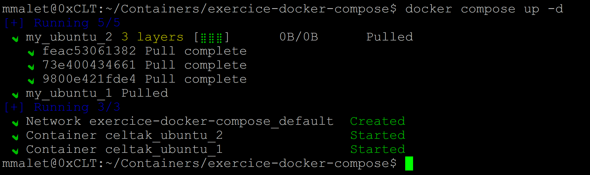
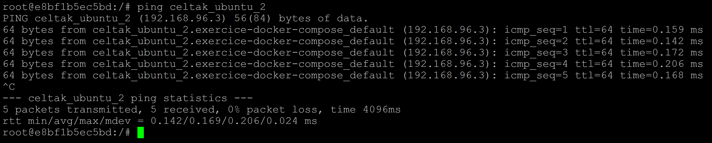
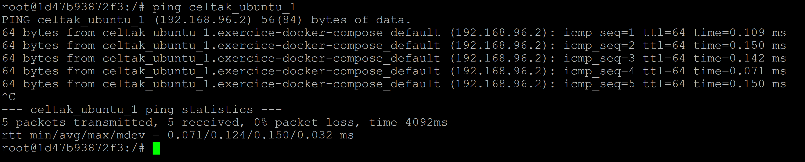
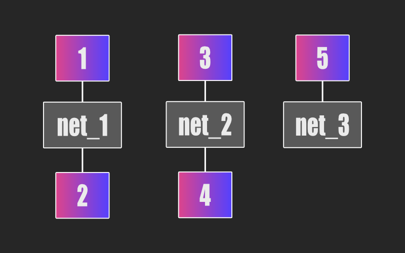
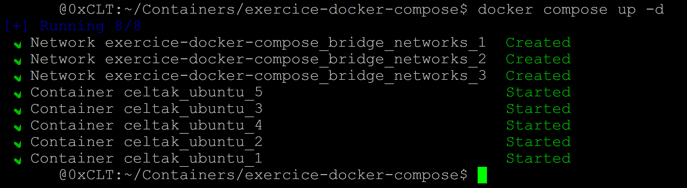

<div align="center">

  <br></br>
  
  <a href="https://github.com/0xCyberLiTech">
    
  </a>
  
  <br></br>

  <h2>Laboratoire numérique pour la cybersécurité, Linux & IT.</h2>

  <p align="center">
    <p align="center">
      <a href="https://0xcyberlitech.github.io/">
        
      </a>
      <a href="https://github.com/0xCyberLiTech">
        
      </a>
      <a href="https://github.com/0xCyberLiTech/Docker/releases/latest">
        
      </a>
      <a href="https://github.com/0xCyberLiTech/Docker/blob/main/CHANGELOG.md">
        
      </a>
      <a href="https://github.com/0xCyberLiTech?tab=repositories">
        
      </a>
      <a href="https://github.com/0xCyberLiTech/Docker/graphs/contributors">
        
      </a>
    </p>
  </p>

</div>

<div align="center">
  
</div>

<div align="center">
  <p>
    <strong>Cybersécurité</strong>  • <strong>Linux Debian</strong>  • <strong>Sécurité informatique</strong> 
  </p>
</div>

---

<div align="center">
  
## À propos & Objectifs.

</div>

Ce projet propose des solutions innovantes et accessibles en cybersécurité, avec une approche centrée sur la simplicité d’utilisation et l’efficacité. Il vise à accompagner les utilisateurs dans la protection de leurs données et systèmes, tout en favorisant l’apprentissage et le partage des connaissances.

Le contenu est structuré, accessible et optimisé SEO pour répondre aux besoins de :
- 🎓 Étudiants : approfondir les connaissances
- 👨‍💻 Professionnels IT : outils et pratiques
- 🖥️ Administrateurs système : sécuriser l’infrastructure
- 🛡️ Experts cybersécurité : ressources techniques
- 🚀 Passionnés du numérique : explorer les bonnes pratiques

---

## DOCKER leçon 03 - Réseau.

- [Conteneurs connectés automatiquement.](#balise-01)
- [Créer un réseau.](#balise-02)
- [Connecter des conteneurs via des réseaux personnalisés.](#balise-03)
- [Tester les réseaux.](#balise-04)
 
Les réseaux dans docker-compose.yml

<a name="balise-01"></a>
-  ## Conteneurs connectés automatiquement.

Il faut savoir qu'automatiquement les conteneurs de notre fichier, sont connectés entre eux.

Nous allons vérifier cette affirmation.

Pour cela, modifions notre docker-compose.yml. 

En premier, on va supprimer le volume créé précédemment.

Pour manipuler les réseaux, il nous faut plusieurs conteneurs. 

Ce qui est logique, car il faut au minimum deux entités pour pourvoir les connecter.

Nous allons donc créer un autre service dans notre docker-compose.yml.

Nous allons baser ce conteneur sur la même image du service précédente et nous l'appellerons celtak_ubuntu_2. Le service par contre nous le nommerons my_ubuntu_2.

Et pour nous y retrouver, nous allons modifier le nom du premier service et le nom de son conteneur respectivement par celtak_ubuntu_1 et my_ubuntu_1.

Que ce passe-t-il si les noms de deux services sont identiques et les noms de deux conteneurs sont identiques ? Pour les services, un seul sera lancé 😒. Et s'il y a deux conteneurs qui portent le même, il y aura conflit sur les conteneurs 😡.

```
version: '3.8'

services:
  my_ubuntu_1:
    image: celtak/ubuntu-ping-ip
    container_name: celtak_ubuntu_1
    stdin_open: true
    tty: true

  my_ubuntu_2:
    image: celtak/ubuntu-ping-ip
    container_name: celtak_ubuntu_2
    stdin_open: true
    tty: true
```

Lancez les services du fichier grâce à la commande ci-dessous.

```
docker compose up -d
```



Maintenant ouvrez deux fenêtres du terminal et connectez-vous aux deux conteneurs (une connexion par fenêtre).

- Première fenêtre :

(Container - celtak_ubuntu_1)

```
docker exec -it e8bf1b5ec5bd bash
```

(Container - celtak_ubuntu_2)

```
docker exec -it 1d47b93872f3 bash
```

Dans le conteneur (celtak_ubuntu_1) tapez la commande ci-dessous.

```
ping celtak_ubuntu_2
```



- Deuxième fenêtre :

Dans le conteneur (celtak_ubuntu_2) tapez la commande ci-dessous.

```
ping celtak_ubuntu_1
```



Ils réussissent à communiquer ce qui affirme ce que nous avons dit juste avant.

Les conteneurs présents dans un fichier docker-compose.yml sont automatiquement connectés entre eux.

Mais est-il possible de personnalisé les choses ?

<a name="balise-02"></a>
- ## Créer un réseau.

La première étape pour utiliser des réseaux personnalisés, consiste à les créer.

Pour cela, il faut utiliser le mot-clé networks:. Ensuite, après tabulation, on pourra insérer le nom du réseau.

Pratiquons ce que nous venons de dire.

```
version: '3'

services:
  my_ubuntu_1:
    image: celtak/ubuntu-ping-ip
    container_name: celtak_ubuntu_1
    stdin_open: true
    tty: true

  my_ubuntu_2:
    image: celtak/ubuntu-ping-ip
    container_name: celtak_ubuntu_2
    stdin_open: true
    tty: true

networks:
  test_networks:
```

Dans notre exemple, nous avons déterminé un réseau personnalisé qui porte le nom test_networks:. 

Mais les deux conteneurs ne sont toujours pas connectés via ce réseau (mais par contre comme nous l'avons vu précédemment, ils le sont automatiquement via le réseau par défaut).

Il est possible de spécifier le type (ou pilotes) du réseau.

Pour l'exemple, nous allons spécifier le réseau bridge.

```
version: '3'

services:
  my_ubuntu_1:
    image: celtak/ubuntu-ping-ip
    container_name: celtak_ubuntu_1
    stdin_open: true
    tty: true

  my_ubuntu_2:
    image: celtak/ubuntu-ping-ip
    container_name: celtak_ubuntu_2
    stdin_open: true
    tty: true

networks:
  test_networks:
    driver: bridge
```

Maintenant nous allons connecter les conteneurs entre eux.

<a name="balise-03"></a>
- ## Connecter des conteneurs via des réseaux personnalisés.

Pour bien comprendre le fonctionnement, nous allons utiliser cinq conteneurs.

- Les deux premiers seront reliés par un réseau. 
- Les deux suivants seront connectés par un autre réseau.
- Et enfin le dernier sera seul dans son réseau.

Nous allons utiliser un schéma pour entrevoir ce que nous souhaitons.



Désormais nous allons traduire le schéma dans le docker-compose.yml.

```
version: '3'

services:
  my_ubuntu_1:
    image: celtak/ubuntu-ping-ip
    container_name: celtak_ubuntu_1
    stdin_open: true
    tty: true
    networks:
      - bridge_networks_1 

  my_ubuntu_2:
    image: celtak/ubuntu-ping-ip
    container_name: celtak_ubuntu_2
    stdin_open: true
    tty: true
    networks:
      - bridge_networks_1 

  my_ubuntu_3:
    image: celtak/ubuntu-ping-ip
    container_name: celtak_ubuntu_3
    stdin_open: true
    tty: true
    networks:
      - bridge_networks_2 

  my_ubuntu_4:
    image: celtak/ubuntu-ping-ip
    container_name: celtak_ubuntu_4
    stdin_open: true
    tty: true
    networks:
      - bridge_networks_2 

  my_ubuntu_5:
    image: celtak/ubuntu-ping-ip
    container_name: celtak_ubuntu_5
    stdin_open: true
    tty: true
    networks:
      - bridge_networks_3

networks:
  bridge_networks_1:
    driver: bridge
  bridge_networks_2:
    driver: bridge
  bridge_networks_3:
    driver: bridge
```

Analysons le contenu du fichier.

Comme indiqué en haut, nous avons créé trois réseaux bridge.

Nous avons par la suite, rattaché les cinq conteneurs aux réseaux selon les détails du schéma. Pour les relier à des réseaux, nous avons utilisé le mot-clé networks: suivi du nom du réseau. Par exemple - bridge_networks_1.

Testons les choses afin de vérifier le système.

Commençons par lancer le docker-compose.yml.

```
docker-compose up -d
```



<a name="balise-04"></a>
- ## Tester les réseaux.

Maintenant, il est possible de faire des tests.

Normalement à ce stade, vous savez les faire.

Je ne vais donc pas vous montrer les commandes. Je vais juste vous proposer des tests sous formes de question.

Je vous encourage à tester de votre côté pour bien comprendre.

Est-ce qu'il est possible de faire communiquer my_ubuntu_1 et my_ubuntu_2 ?

Oui, car ils font parties du même réseau.

Pouvons-nous transmettre des informations à my_ubuntu_3 à partir de my_ubuntu_1 ?

Non ce n'est pas possible. Ils ne font pas partie du même réseau.

Avec my_ubuntu_5, sur quels conteneurs je peux communiquer ?

Aucun d'entre eux, car my_ubuntu_5 est seul dans son réseau.

Parfait 🙂 ! Vous savez à présent bien utiliser les réseaux via le docker-compose.yml.

---

<div align="center">

<table>
<tr>
<td align="center"><b>🖥️ Infrastructure & Sécurité</b></td>
<td align="center"><b>💻 Développement & Web</b></td>
<td align="center"><b>🤖 Intelligence Artificielle</b></td>
</tr>
<tr>
<td align="center">
  <a href="https://www.kernel.org/"></a>
  <a href="https://www.debian.org"></a>
  <a href="https://www.gnu.org/software/bash/"></a>
  <br/>
  <a href="https://nginx.org"></a>
  <a href="https://git-scm.com"></a>
</td>
<td align="center">
  <a href="https://www.python.org"></a>
  <a href="https://flask.palletsprojects.com"></a>
  <a href="https://developer.mozilla.org/docs/Web/HTML"></a>
  <br/>
  <a href="https://developer.mozilla.org/docs/Web/CSS"></a>
  <a href="https://developer.mozilla.org/docs/Web/JavaScript"></a>
  <a href="https://code.visualstudio.com"></a>
</td>
<td align="center">
  <a href="https://ollama.com"></a>
  <br/><br/>
  <a href="https://anthropic.com"></a>
</td>
</tr>
</table>

<br/>

<sub>🔒 Projets proposés par <a href="https://github.com/0xCyberLiTech">0xCyberLiTech</a> · Développés en collaboration avec <a href="https://claude.ai">Claude AI</a> (Anthropic) 🔒</sub>

</div>

